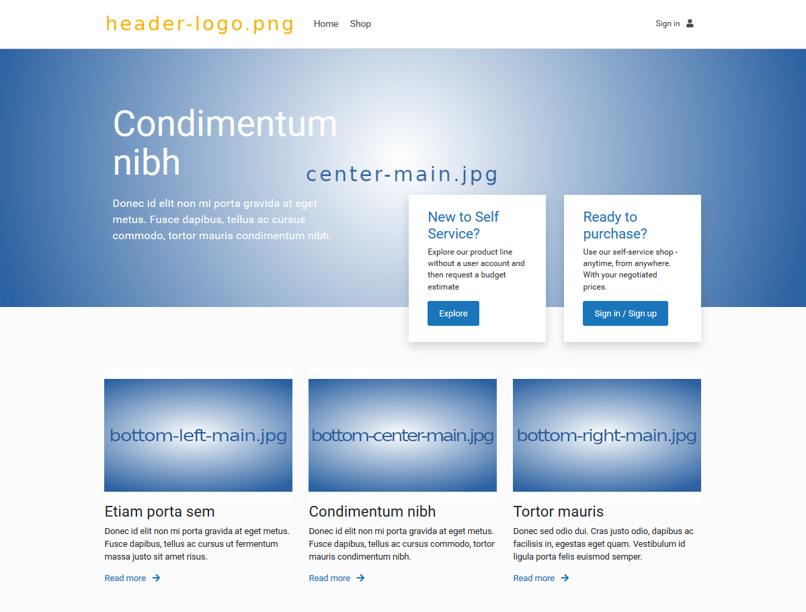

# Tacton CPQ LeadGen and Customer Self Service GUI framework

This git repository contains an example GUI code and application communicating with *Tacton CPQ LeadGen API* and *Customer Self-service API*. 
It can be used as a starting template when creating an extranet with e-commerce functionality, e.g. in a Tacton CPQ project or demo. 
This GUI framework application requires a running Tacton CPQ instance, with LeadGen API and Customer Self-service feature licenses activated.
Before start using this framework, you should be acquainted with the scope and functions of the *Tacton CPQ LeadGen API* and *Customer Self-service API*, 
which you find in the Help center of your Tacton CPQ instance.

This repository contains general images and text for running and debugging the application. 
Imagery and text messages should be tailored for your particular Tacton CPQ LeadGen/Customer Self-service project.

A developer should build executable jar file in "customerselfservice" project. A developer should prepare 
specific for the project configuration file, message file and images in separate folders. To deploy the application, 
a developer should copy jar file and specific files from separate project to destination folder. The destination folder must 
contain the following files and folders:
<table>
<tr><td>config.properties</td><td>the file contains specific application settings</td></tr>
<tr><td>customer-self-service.jar</td><td>the executable application file</td></tr>
<tr><td>messages.properties</td><td>the file contains specific application texts</td></tr>
<tr><td>products/ </td><td>folder containing specific pictures for configurator</td></tr>
<tr><td>images/ </td><td>folder containing specific pictures for the application </td></tr>
</table>

The "images/" folder must contain following pictures to display on main project landing page (see picture below). 

- favicon.png - icon of the application visible in the browser
- header-logo.png
- center-main.jpg
- bottom-left-main.jpg
- bottom-center-main.jpg
- bottom-right-main.jpg

The "products/" folder is a place to store model specific images (product images and group images displayed in 
the configurator).

## Separate LeadGen instance - only using the Leadgen API

This application can communicate with both Tacton CPQ LeadGen API as well as the Customer Self-service API. 
However, if your project wants to use LeadGen API only, this is also possible. 
It is possible to start LeadGen application separately from Customer Self service. In this case LeadGen is just HTML page with style sheets and Java Scripts.

To deploy LeadGen separately, copy content of the "src/main/resources/static" folder to your destination folder and adjust 
"leadgen.js" file. Use values from "config.properties" file and insert them to the "leadgen.js" file. Adjust the parameter 
"local_site_name" value to match your path to resources (destination folder). 

Copy specific configuration images to "/products" folder. Copy your specific images to the "/images" folder.  
The destination folder should contain following items:
<table>
<tr><td>style and Java Script folders</td><td>copy from src/main/resources/static source folder</td></tr>
<tr><td>leadgen.js</td><td>Lead Gen parameters file</td></tr>
<tr><td>leadgen.html</td><td>main Lead Gen HTML file</td></tr>
<tr><td>products/ </td><td>folder containing specific pictures for configurator</td></tr>
<tr><td>images/ </td><td>folder containing specific pictures for the application </td></tr>
</table>

To start LeadGen enter the URL in the browser: http://your_server/leadgen.html

## Separate Customer Self Service instance - only using the Customer Self-service API

If your project only needs to communicate with the Customer Self service API, you can easily exclude the LeadGen part. To do so, simply remove link to LeadGen from main landing page. Just edit the 
"src/main/resources/templates/index.html" file and remove the button with link: "/configure". 
You can also tailor the page to your needs.